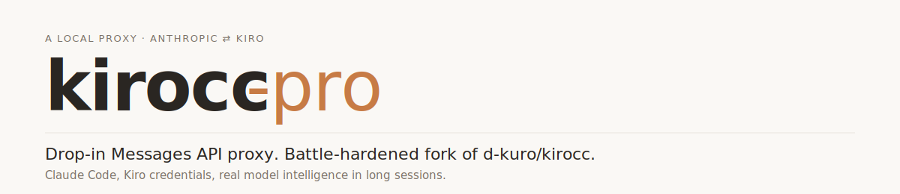
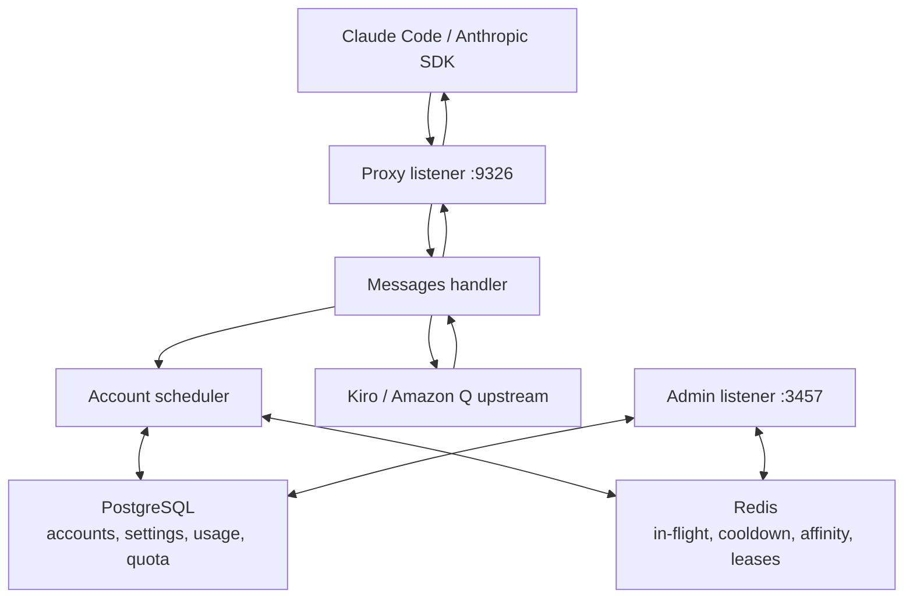

<div align="right">

**English** · [简体中文](./README.zh-CN.md)

</div>

<p align="center">
  <picture>
    <source media="(prefers-color-scheme: dark)" srcset="./assets/hero-dark.svg">
    <source media="(prefers-color-scheme: light)" srcset="./assets/hero-light.svg">
    
  </picture>
</p>

# kirocc-pro

kirocc-pro is a local proxy that accepts the Anthropic Messages API and sends requests to Kiro / Amazon Q CodeWhisperer upstream services. Claude Code and Anthropic-compatible SDKs can use it by setting `ANTHROPIC_BASE_URL`.

The current architecture is intentionally strict:

| Area | Backend |
|---|---|
| Accounts, OAuth credentials and quota snapshots | PostgreSQL |
| Runtime-mutable settings and API keys | PostgreSQL |
| Usage records and request history | PostgreSQL |
| In-flight reservations, cooldowns and session affinity | Redis |

There is no local-file persistence mode and no single-account fallback. JSON is accepted only as an import payload from the Admin UI/API, then normalized and persisted to PostgreSQL.

The migration evidence is tracked in [`docs/pgredis-complete-migration-audit.zh-CN.md`](./docs/pgredis-complete-migration-audit.zh-CN.md).

## Quick Start

Prerequisites:

- Go 1.26+
- `GOEXPERIMENT=jsonv2`
- Docker Compose for local PostgreSQL and Redis
- At least one Kiro account added through the Admin UI or Admin API

Start local infrastructure:

```bash
docker compose -f docker-compose.dev.yml up -d
```

Run the proxy:

```bash
GOEXPERIMENT=jsonv2 go run ./cmd/kirocc \
  -pool-strategy least-inflight
```

Default local endpoints:

| Service | URL |
|---|---|
| Proxy | `http://127.0.0.1:9326` |
| Admin UI | `http://127.0.0.1:3457/admin/` |
| PostgreSQL | `127.0.0.1:15432` |
| Redis | `127.0.0.1:16379` |

Use from Claude Code:

```bash
export ANTHROPIC_BASE_URL=http://127.0.0.1:9326
export ANTHROPIC_AUTH_TOKEN=dummy
claude
```

If `-api-key` is configured, set `ANTHROPIC_AUTH_TOKEN` to that key instead of `dummy`.

## Adding Accounts

Use the Admin UI at `#/accounts`:

- OAuth flow: click add account, optionally set `proxy_url`, finish browser login.
- Manual import: upload or paste an account JSON / JSONL export. The service accepts common camelCase and snake_case spellings, normalizes them, validates the final credential, and writes the result to PostgreSQL.

The import file is a transport format, not the system storage backend. After import, token refreshes, quota snapshots and account edits are persisted in PostgreSQL.

## API Surface

The standard Anthropic-compatible path remains unchanged:

```text
/v1/models
/v1/messages
/v1/messages/count_tokens
```

Custom route prefixes are mounted under `/api` so they do not collide with frontend routes:

```text
/api/cc/v1/models
/api/cc/v1/messages
/api/cc/v1/messages/count_tokens

/api/ha/v1/models
/api/ha/v1/messages
/api/ha/v1/messages/count_tokens

/api/na/v1/models
/api/na/v1/messages
/api/na/v1/messages/count_tokens
```

For a configured custom route named `<name>`, the effective route is `/api/<name>`. The `/v1` route is not prefixed.

## Main Features

| Capability | Notes |
|---|---|
| Anthropic Messages API | Streaming SSE and non-streaming responses |
| Model mapping | Anthropic-form model IDs mapped to Kiro SKUs |
| Extended Thinking | XML-based upstream injection from model suffix, beta header or request thinking config |
| Tool Search | Proxy-side regex/BM25 tool discovery loop |
| Prompt Cache Reporting | Path/profile-based downstream usage reporting without changing the upstream payload |
| Truncation detection | A continuation hint is injected into the next request after clipped output |
| Multi-account scheduling | `round-robin`, `fill-first`, `least-used`, `least-inflight`, `weighted-least-inflight` |
| Per-account concurrency | `max_in_flight` limits concurrent upstream requests per account |
| Session affinity | Redis TTL binding from client session to account |
| Cooldown | Redis-backed account/model cooldown with `Retry-After` support |
| Quota polling | Periodic Kiro quota refresh with bounded worker concurrency |
| Usage records | Request path, account, API key, status, error, first-token latency and token usage |

## Scheduling

The scheduler keeps a local account snapshot for fast selection, but cross-request runtime state is coordinated through Redis:

- `in-flight`: an active reservation count for an account and model.
- `per-account concurrency limit`: an account can reject new reservations when its Redis in-flight count reaches `max_in_flight`.
- `least-inflight`: the selector prefers the ready account with the lowest running request count.
- `cooldown`: rate-limit and auth-error state is mirrored to Redis with TTLs.
- `reservation lease`: every acquired account has a Redis lease so crashed requests eventually release capacity.

For pools with dozens of accounts and about 300 RPM, use `least-inflight` or `weighted-least-inflight` unless there is a strong reason to drain high-priority accounts first.

## Prompt Cache Reporting

Prompt-cache reporting is a local reporting module. It does not mutate the payload sent to Kiro.

The default profiles are based on the existing route families:

| Route | Profile | Behavior |
|---|---|---|
| `/v1/messages` | `default` | Preserve input/output, report computed cache read/write tokens |
| `/api/cc` | `cc` | Sample visible input under a configured cap and move the delta to cache read |
| `/api/ha` | `ha` | Similar input sampling, preserve computed cache creation |
| `/api/na` | `na` | Do not synthesize local cache usage |

Profiles are editable in Admin UI `System Settings -> Prompt Cache`, with form controls and a JSON editor.

See [`docs/prompt-cache-report-profiles.zh-CN.md`](./docs/prompt-cache-report-profiles.zh-CN.md) for field-level behavior.

## Admin UI

The Admin server is a separate listener and is not reachable through the proxy port.

| Method | Path | Purpose |
|---|---|---|
| `GET` | `/admin/health` | Pool and quota summary |
| `GET` | `/admin/accounts` | Account rows with quota and in-flight state |
| `POST` | `/admin/accounts` | Add one account |
| `POST` | `/admin/accounts/import` | Import accounts from request payload |
| `POST` | `/admin/accounts/{id}/refresh` | Queue a quota refresh |
| `PATCH` | `/admin/accounts/{id}` | Edit account metadata |
| `DELETE` | `/admin/accounts/{id}` | Delete from PostgreSQL and scheduler |
| `GET` | `/admin/usage/recent` | Recent request records |
| `GET` | `/admin/usage` | Token aggregation by model, API key, device or account |
| `GET` / `PUT` | `/admin/settings` | Runtime settings stored in PostgreSQL |

`/admin/credsfile` is intentionally retained only as a `410 Gone` tombstone for old clients.

## Configuration

Important flags:

| Flag | Default | Purpose |
|---|---|---|
| `-port` | `9326` | Proxy listen port |
| `-host` | `127.0.0.1` | Proxy bind host |
| `-api-key` | empty | Optional proxy API key |
| `-admin` | `true` | Enable Admin server |
| `-admin-host` | `127.0.0.1` | Admin bind host |
| `-admin-port` | `3457` | Admin listen port |
| `-admin-key` | empty | Admin login key |
| `-pool-strategy` | `round-robin` | Account selector strategy |
| `-affinity-ttl` | `30m` | Redis session affinity TTL |
| `-usage-mem-cap` | `10000` | In-memory recent usage ring size |
| `-quota-poll-interval` | `3m` | Automatic quota refresh interval |
| `-postgres-dsn` | local dev DSN | PostgreSQL source of truth |
| `-redis-addr` | `127.0.0.1:16379` | Redis runtime state address |
| `-redis-password` | empty | Redis password |
| `-redis-db` | `0` | Redis database number |
| `-redis-key-prefix` | `kirocc:dev:` | Redis key namespace |
| `-redis-lease-ttl` | `30m` | In-flight reservation lease |
| `-prompt-cache-reports` | empty | JSON profile override |
| `-geoip-mmdb` | empty | GeoLite2-Country file for region routing |
| `-codex-proxy` | empty | Outbound proxy for the Codex provider |

Environment variables mirror these flags, for example `KIROCC_POSTGRES_DSN`, `KIROCC_REDIS_ADDR`, `KIROCC_POOL_STRATEGY`, `KIROCC_ADMIN_KEY`, `KIROCC_PROMPT_CACHE_REPORTS`, and `KIROCC_GEOIP_MMDB`.

Legacy local-file environment variables are rejected during startup. See the migration audit document for the exact rejection list.

## Development Checks

```bash
node --check internal/admin/html/app.js
GOEXPERIMENT=jsonv2 go test ./...
GOEXPERIMENT=jsonv2 go test -run '^$' -tags e2e ./internal/e2e
```

Run the dependency residue check from the migration audit before release.

## Architecture



## Security Notes

- Bind the proxy and Admin server to loopback unless you have a reverse proxy, TLS and firewalling in place.
- Configure `-api-key` for any non-local client.
- Configure `-admin-key` before exposing the Admin UI outside a trusted local machine.
- Tokens are stored in PostgreSQL and are never printed by normal API responses.
- Account list rows may show operational labels, while account detail endpoints are intended for authenticated operators.

## License

Apache License 2.0. See [`LICENSE`](./LICENSE). This project is downstream of [`d-kuro/kirocc`](https://github.com/d-kuro/kirocc) and preserves upstream copyright notices.
