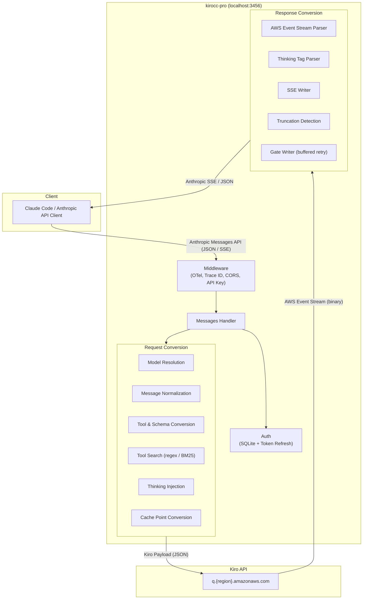

<div align="right">

**English** · [简体中文](./README.zh-CN.md)

</div>

<p align="center">
  <picture>
    <source media="(prefers-color-scheme: dark)" srcset="./assets/hero-dark.svg">
    <source media="(prefers-color-scheme: light)" srcset="./assets/hero-light.svg">
    
  </picture>
</p>

<p align="center">
  <a href="./LICENSE"></a>
  
  
  <a href="https://github.com/d-kuro/kirocc"></a>
  <a href="./README_3460_OPTIMIZED.md"></a>
</p>

> **Fork notice.** Downstream of [`d-kuro/kirocc`](https://github.com/d-kuro/kirocc), Apache-2.0. Adds 8 stability and intelligence fixes (see [`README_3460_OPTIMIZED.md`](./README_3460_OPTIMIZED.md)) plus a session-id fallback patch (`internal/app/messages/handler.go`, search for `// [fork]`). All upstream copyright headers and the original `LICENSE` are preserved.
>
> **Admin UI extensions.** Multi API keys with expiry + token quota, usage attribution by key / device, per-account proxy, region routing (GeoIP), kirocc optimization knobs, remote API automation — full docs in [`docs/admin-features.zh-CN.md`](./docs/admin-features.zh-CN.md) (Chinese; the admin UI itself is Chinese-first).

---

## What it is

A local proxy that speaks the **Anthropic Messages API** on the front and the **Kiro / Amazon Q CodeWhisperer** AWS Event Stream on the back. Set `ANTHROPIC_BASE_URL` from any Anthropic SDK (Claude Code is the canonical case) and you get Claude on Kiro credentials, with proxy-side hardening for long sessions and complex tool flows.

Pure Go, no CGO, statically cross-compilable. Drives [`modernc.org/sqlite`](https://gitlab.com/cznic/sqlite) for the Kiro CLI credential database.

## Quick start

```bash
go install github.com/niuma/kirocc-pro/cmd/kirocc@latest
kirocc                                              # listens on 127.0.0.1:3456

export ANTHROPIC_BASE_URL=http://127.0.0.1:3456
export ANTHROPIC_AUTH_TOKEN=dummy                   # not used unless -api-key is set
claude
```

Or build locally:

```bash
git clone https://github.com/niuma/kirocc-pro.git
cd kirocc-pro
GOEXPERIMENT=jsonv2 make build                      # outputs dist/kirocc
```

Requires Go 1.26+ and a logged-in [Kiro CLI](https://kiro.dev) (the SQLite credential store).

## How it works

<p align="center">
  <picture>
    <source media="(prefers-color-scheme: dark)" srcset="./assets/architecture-dark.svg">
    <source media="(prefers-color-scheme: light)" srcset="./assets/architecture-light.svg">
    
  </picture>
</p>

The proxy translates in both directions:

1. **Request side.** Anthropic JSON arrives, kirocc normalizes messages, sanitizes JSON Schema, resolves the model, injects thinking config as XML tags, converts `cache_control` to Kiro `cachePoint`, and emits the Kiro payload.
2. **Auth side.** Credentials come straight from the Kiro CLI SQLite DB; expired access tokens are refreshed via the refresh token and written back atomically.
3. **Response side.** Kiro returns an AWS Event Stream of binary frames. kirocc parses them, computes deltas from cumulative text, intercepts `ToolSearch` calls, runs `<thinking>` tag parsing, enforces `stop_sequences` / `max_tokens` adapter-side, and emits Anthropic-compatible SSE.
4. **Gate Writer.** Buffers output until visible content arrives, so thinking-only responses can be transparently retried without leaking partial frames to the client.

## Features

###  Protocol translation

| Capability | Notes |
|---|---|
| `POST /v1/messages` | Streaming SSE and non-streaming JSON |
| `POST /v1/messages/count_tokens` | Approximate via `cl100k_base` ([tiktoken-go](https://github.com/pkoukk/tiktoken-go)) |
| `GET /v1/models` | Exposes the mapped Claude SKUs |
| `GET /health` | Liveness probe |

###  Intelligence (proxy-side)

| Capability | What it does |
|---|---|
| **Extended Thinking** | XML injection (`<thinking_mode>`, `<max_thinking_length>`), with budget from `thinking.budget_tokens`, `output_config.effort`, or env-var floor (see fork hardening) |
| **Tool Search** | Proxy-side implementation of Anthropic's [Tool Search Tool](https://platform.claude.com/docs/en/agents-and-tools/tool-use/tool-search-tool), `tool_search_tool_regex_20251119` and `_bm25_20251119`, with up to 3 discovery rounds |
| **Prompt Caching** | Tool-level `cache_control` is converted to Kiro `cachePoint` |
| **Truncation detection** | A continuation notice is injected into the next request when a response was clipped |
| **Model mapping** | Anthropic-form IDs (`claude-sonnet-4-6`) map to Kiro SKUs (`claude-sonnet-4.6`); customizable via `KIROCC_MODEL_MAPPINGS` |

###  Reliability

| Capability | What it does |
|---|---|
| **Auth lifecycle** | Reads the Kiro CLI SQLite DB, refreshes Social / OIDC tokens, writes back atomically |
| **Retry** | Exponential backoff on 403 (token expiry), 429, 5xx; also retries thinking-only empty-visible responses |
| **API key** | Optional `-api-key` gate on the proxy itself |
| **CORS** | Localhost-origin allowlist |

###  Observability

| Capability | What it does |
|---|---|
| **File logging** | Structured OTel JSON Lines, rotated via [lumberjack](https://github.com/natefinch/lumberjack) (defaults sized for coding-agent ingest) |
| **OpenTelemetry** | `-otel` enables an OTLP/HTTP exporter; full request chain spans with header and body events |

###  Fork hardening

Eight fixes on top of upstream `d-kuro/kirocc` targeting long sessions and broken tool calls. Summary table; full rationale lives in [`README_3460_OPTIMIZED.md`](./README_3460_OPTIMIZED.md).

| # | Fix | Effect |
|---|---|---|
| 1 | Strip historical MCP `system-reminder` blocks | About 14% fewer prompt tokens on the test sample |
| 2 | Preserve non-MCP system reminders | Keeps `currentDate` and the like, drops only the bulky MCP tool dumps |
| 3 | Top-level `required` schema check on tool inputs | `Write {}` and `Edit {}` with missing fields never leak to Claude Code |
| 4 | Top-level type check on tool inputs | `AskUserQuestion.questions=<string>` is caught proxy-side |
| 5 | Reflow invalid `tool_use` as `tool_result(is_error=true)` | One self-heal round before any client-visible failure |
| 6 | Visible-error fallback after a second invalid `tool_use` | Bounded retry; no 502 deadlocks |
| 7 | `ToolSearch` errors return `tool_search_tool_result_error` | A bad tool call no longer kills the whole turn with HTTP 400 |
| 8 | `KIROCC_FORCE_THINKING_BUDGET` floor at the proxy layer | Client `MAX_THINKING_TOKENS` doesn't always reach upstream, this enforces it |

Fixes 5 and 6 together implement a two-stage recovery for malformed `tool_use` blocks; the decision tree:

<p align="center">
  <picture>
    <source media="(prefers-color-scheme: dark)" srcset="./assets/logic-invalid-tool-dark.svg">
    <source media="(prefers-color-scheme: light)" srcset="./assets/logic-invalid-tool-light.svg">
    
  </picture>
</p>

Plus a session-id fallback: `/v1/messages` no longer requires `X-Claude-Code-Session-Id`; a trace-id is synthesized when the header is missing.

## Multi-account pool

For users with several Kiro accounts (`KIRO PRO` keys, gift credits, secondary trials) the proxy can load all of them from a single JSON file and rotate intelligently between them. Without a JSON file it falls back to the upstream single-account SQLite path; the multi-account flow is fully opt-in.

### Credentials JSON format

Top-level array, one entry per account. Schema is compatible with `cockpit-tools` / `cli-proxy-api` exports, so existing exports can be dropped in unchanged.

```jsonc
[
  {
    "id": "kiro-alice-001",
    "label": "alice@example.com (Pro)",
    "priority": 100,
    "disabled": false,
    "disable_cooling": false,
    "kiro_auth_token_raw": {
      "accessToken":  "<redacted>",
      "refreshToken": "<redacted>",
      "expiresAt":    "2026-05-20T10:00:00Z",
      "profileArn":   "arn:aws:codewhisperer:us-east-1:000000000000:profile/EXAMPLE",
      "authMethod":   "Social",
      "region":       "us-east-1"
    }
  }
]
```

Default path: `~/.config/kirocc/credentials.json` (auto-loaded when present). Override with `-creds-json` or `KIROCC_CREDS_JSON`.

### Scheduling strategy

| `-pool-strategy` | Behavior | When to use |
|---|---|---|
| `round-robin` (default) | Cycles through ready accounts in priority order | Even load across similar-tier accounts |
| `fill-first` | Burns the highest-priority account until it cools down | Tier-1 plans you want to drain before tier-2 starts |
| `least-used` | Picks the account with the fewest successes inside the top-priority tier | Long-running deployments wanting balanced wear |

Each credential carries a per-account and a per-model cooldown timer. The selector skips a credential that is cooling on the requested model even if its account-level state is clean.

### Cooldown

On a `429` (or any rate-limit error), the credential enters exponential backoff: `30s → 60s → 120s → ... → 30min cap`. `Retry-After` headers are honored when present. Set `"disable_cooling": true` on a credential to bypass cooldown entirely (intended for unlimited-tier keys).

### Session affinity

Each Claude Code session (identified by `X-Claude-Code-Session-Id`, or a synthesized trace-id) is bound to one credential for the duration. When the bound credential enters cooldown, a temporary alternate is selected **for that request only**; the next request after recovery returns to the original credential. TTL defaults to 30 min (`-affinity-ttl`).

### Token refresh

Both modes auto-refresh OAuth tokens before expiry:

- **Single-account**: refreshed through the existing SQLite-backed `AuthManager` path. Both `Social` and `IAM`/`IDC` flows.
- **Multi-account**: each credential is preemptively refreshed when within 5 minutes of expiry (`Social` flow via Kiro's `prod.{region}.auth.desktop.kiro.dev/refreshToken`, `IDC` flow via AWS SSO OIDC). The updated `accessToken` / `refreshToken` / `expiresAt` are atomically written back to the JSON file so a restart picks up the rotated state. Refresh failures are logged and the original token is used for the request; if it then fails with 403 the credential gets marked auth-error and the next request rotates to another credential.

## Admin dashboard

A separate HTTP listener on `127.0.0.1:3457` (configurable) exposes a Chinese-language admin UI and a JSON API for inspecting the pool, refreshing quotas, and tracking usage. The admin port is intentionally **isolated** from the proxy port: nothing about its routes is reachable from the proxy URL.

### Authentication

| Mode | When |
|---|---|
| **Open** | `-admin-key` not set. All `/admin/*` paths are public. The server logs a warning at startup. Only safe on loopback. |
| **Key required** | `-admin-key` set (env: `KIROCC_ADMIN_KEY`). Browser users see a Chinese login form at `/admin/login`; CLI clients pass `Authorization: Bearer <key>`. |

Cookie auth uses an HttpOnly, `SameSite=Strict`, `Path=/admin` cookie. Logout via `POST /admin/logout` clears it.

### Endpoints

| Method | Path | Returns |
|---|---|---|
| `GET` | `/admin` | Single-page dashboard (HTML) |
| `GET` | `/admin/health` | Totals: active / cooldown / disabled / credits remaining |
| `GET` | `/admin/accounts` | Per-account rows with masked label + 24h stats |
| `GET` | `/admin/accounts/{id}` | Full detail (unmasked) for one account |
| `POST` | `/admin/accounts/{id}/refresh` | Force a Kiro `getUsageLimits` refresh |
| `POST` | `/admin/accounts/{id}/disable` | Manual disable |
| `POST` | `/admin/accounts/{id}/enable` | Manual re-enable (clears disabled state + backoff) |
| `GET` | `/admin/usage?window=24h&group=model` | Usage rollup by model |
| `GET` | `/admin/usage/timeline?window=2h&bucket=10m` | Bucketed time series |
| `GET` | `/admin/login` · `POST` | Login form / submit |
| `POST` | `/admin/logout` | Clears session cookie |

### CLI examples

```bash
# health summary
curl -H "Authorization: Bearer $KIROCC_ADMIN_KEY" \
     http://127.0.0.1:3457/admin/health | jq

# 24h usage by model
curl -H "Authorization: Bearer $KIROCC_ADMIN_KEY" \
     "http://127.0.0.1:3457/admin/usage?window=24h&group=model" | jq

# force a quota refresh on one account
curl -XPOST -H "Authorization: Bearer $KIROCC_ADMIN_KEY" \
     http://127.0.0.1:3457/admin/accounts/kiro-alice-001/refresh | jq
```

## Quota monitoring

Every `-quota-poll-interval` (default 60s) the proxy hits Kiro's `getUsageLimits` endpoint for each non-disabled credential (semaphore-limited to 5 concurrent fetches) and stores the parsed result. The dashboard surfaces:

- Plan name (e.g. `KIRO PRO`, `KIRO FREE`) and tier
- Credits total / used / remaining + next reset time
- Bonus credits (free-trial) total / used / expiry days
- Banned / forbidden status (with reason)

A `403` response whose body contains `BANNED:` automatically disables the credential; it will not be selected again until manually re-enabled via `/admin/accounts/{id}/enable`.

## Usage tracking

Per-request token accounting flows through a two-tier store:

| Tier | Backing | Default size | Purpose |
|---|---|---|---|
| Hot | In-memory ring | 10000 records (`-usage-mem-cap`) | Fast queries for the dashboard's recent windows |
| Cold | SQLite append log | `~/.config/kirocc/usage.sqlite` (`-usage-db`) | Historical queries past the ring window |

Records carry: timestamp, credential id, requested model, resolved model, input / output / cache tokens, status (`success` | `rate_limited` | `auth_error` | `upstream_error`), latency, trace id. Set `-usage-db ""` to disable disk persistence.

## Configuration

### Command-line flags

| Flag | Default | Description |
|---|---|---|
| `-port` | `3456` | Listen port |
| `-host` | `127.0.0.1` | Bind host |
| `-db` | (see below) | Kiro CLI SQLite DB path |
| `-api-key` | (none) | API key required to access the proxy |
| `-debug` | `false` | Enable debug logging |
| `-log-file` | (none) | Write logs to a rotating file (file-only by default) |
| `-log-max-size` | `10` | Max log file size in MB before rotation |
| `-log-max-backups` | `5` | Max number of old log files to retain |
| `-log-max-age` | `7` | Max days to retain old log files |
| `-log-compress` | `false` | Compress rotated log files with gzip |
| `-log-console` | `false` | Also write logs to console when `-log-file` is set |
| `-otel` | `false` | Enable OpenTelemetry tracing (OTLP HTTP exporter) |
| `-otel-body-limit` | `32768` | Max bytes of request body captured in OTel spans (0 = unlimited) |
| `-creds-json` | (see notes) | Path to multi-account credentials JSON; empty = single-account SQLite mode |
| `-pool-strategy` | `round-robin` | Credential selection strategy: `round-robin` \| `fill-first` \| `least-used` |
| `-affinity-ttl` | `30m` | How long a session sticks to a credential after inactivity |
| `-admin` | `true` | Enable the admin HTTP server |
| `-admin-host` | `127.0.0.1` | Admin server bind host |
| `-admin-port` | `3457` | Admin server bind port |
| `-admin-key` | (none) | Admin login key; empty = open (no auth, warn at startup) |
| `-usage-db` | (see notes) | SQLite path for usage persistence; empty = memory-only |
| `-usage-mem-cap` | `10000` | In-memory usage ring buffer capacity |
| `-quota-poll-interval` | `1m` | Interval between automatic Kiro quota refreshes |

`-creds-json` defaults to `~/.config/kirocc/credentials.json` (auto-loaded when present, else single-account mode). `-usage-db` defaults to `~/.config/kirocc/usage.sqlite`.

### Default Kiro CLI DB path

| OS | Path |
|---|---|
| macOS | `~/Library/Application Support/kiro-cli/data.sqlite3` |
| Linux | `~/.local/share/kiro-cli/data.sqlite3` |

### Environment variables

Every command-line flag has an equivalent env-var override. Plus the fork-only `KIROCC_FORCE_THINKING_BUDGET`.

| Variable | Maps to |
|---|---|
| `KIROCC_PORT` | `-port` |
| `KIROCC_HOST` | `-host` |
| `KIROCC_DB_PATH` | `-db` |
| `KIROCC_API_KEY` | `-api-key` |
| `KIROCC_DEBUG` | `-debug` |
| `KIROCC_LOG_FILE` | `-log-file` |
| `KIROCC_LOG_MAX_SIZE` | `-log-max-size` |
| `KIROCC_LOG_MAX_BACKUPS` | `-log-max-backups` |
| `KIROCC_LOG_MAX_AGE` | `-log-max-age` |
| `KIROCC_LOG_COMPRESS` | `-log-compress` |
| `KIROCC_LOG_CONSOLE` | `-log-console` |
| `KIROCC_OTEL` | `-otel` |
| `KIROCC_OTEL_BODY_LIMIT` | `-otel-body-limit` |
| `KIROCC_MODEL_MAPPINGS` | Override the model map (JSON array) |
| `KIROCC_FORCE_THINKING_BUDGET` | Fork-only thinking-budget floor (positive integer) |
| `KIROCC_CREDS_JSON` | `-creds-json` |
| `KIROCC_POOL_STRATEGY` | `-pool-strategy` |
| `KIROCC_AFFINITY_TTL` | `-affinity-ttl` |
| `KIROCC_ADMIN` | `-admin` |
| `KIROCC_ADMIN_HOST` | `-admin-host` |
| `KIROCC_ADMIN_PORT` | `-admin-port` |
| `KIROCC_ADMIN_KEY` | `-admin-key` |
| `KIROCC_USAGE_DB` | `-usage-db` |
| `KIROCC_USAGE_MEM_CAP` | `-usage-mem-cap` |
| `KIROCC_QUOTA_POLL_INTERVAL` | `-quota-poll-interval` |

### Custom model mappings

```bash
export KIROCC_MODEL_MAPPINGS='[{"anthropic":"my-model","kiro":"claude-sonnet-4.5","context_window_size":200000}]'
```

### OpenTelemetry tracing

Run an OTLP collector locally and start kirocc with `-otel`:

```bash
docker run -d --name lgtm -p 3000:3000 -p 4317:4317 -p 4318:4318 grafana/otel-lgtm
kirocc -otel
```

The endpoint defaults to `http://localhost:4318`; override with the standard `OTEL_EXPORTER_OTLP_ENDPOINT`.

## Model mappings

| Request model | Kiro SKU | Context window |
|---|---|---|
| `claude-sonnet-4-6` | `claude-sonnet-4.6` | 200k |
| `claude-sonnet-4-6[1m]` | `claude-sonnet-4.6-1m` | 1M |
| `claude-sonnet-4.5` | `claude-sonnet-4.5` | 200k |
| `claude-sonnet-4.5[1m]` | `claude-sonnet-4.5-1m` | 1M |
| `claude-opus-4-7` | `claude-opus-4.7` | 1M |
| `claude-opus-4-7[1m]` | `claude-opus-4.7` | 1M |
| `claude-opus-4-6` | `claude-opus-4.6` | 1M |
| `claude-opus-4-6[1m]` | `claude-opus-4.6` | 1M |
| `claude-opus-4.5` | `claude-opus-4.5` | 200k |
| `claude-haiku-4.5` | `claude-haiku-4.5` | 200k |

Opus 4.6 and 4.7 are always 1M (no 200k SKU upstream). The `[1m]` aliases are first-class entries that preserve the suffix verbatim in the response `model` field; this satisfies Claude Code's `/\[1m\]/i` check for the 1M context window without spuriously enabling extended thinking.

Unmatched `claude-*` models pass through; non-claude models fall back to `claude-sonnet-4.6`.

### Response model ID semantics

The response `model` is the **Anthropic-form ID**, not the Kiro SKU. When routing to a 1M-context model (an always-1M SKU, the `[1m]` suffix, or `Anthropic-Beta: context-1m`), the suffix `[1m]` is appended to the response model. This is how Claude Code chooses the 1M window client-side; without it, the client auto-compacts at ~160k even when upstream actually carries the full 1M.

`[1m]` means different things on each side. On the **request** `model` it is a client-supplied thinking-opt-in signal (stripped before upstream routing). On the **response** `model` it is purely a context-window advertisement and does not imply extended thinking was enabled.

## Extended Thinking

The Kiro API has no dedicated thinking field. kirocc encodes the config as XML tags injected into the message content:

```
<thinking_mode>enabled</thinking_mode>
<max_thinking_length>{budget_tokens}</max_thinking_length>

{user message}
```

Triggered by any of:

- Model name with `[1m]` suffix (e.g. `claude-sonnet-4-6[1m]`)
- `Anthropic-Beta` header containing `context-1m`
- `thinking.type: "enabled"` or `"adaptive"`

Budget resolution order:

1. `thinking.budget_tokens` if explicit
2. `output_config.effort`: `max` = 160000, `xhigh` = 80000, `high` = 40000, `medium` = 10000, `low` = 4000
3. Default: 10000

Fork-only: `KIROCC_FORCE_THINKING_BUDGET` sets a floor (the value never overrides a higher client-provided budget).

## Tool Search

Anthropic's Tool Search Tool lets the model discover tools on demand instead of paying the token cost for all of them upfront. Kiro doesn't support it, so kirocc emulates it:

1. Client sends `tool_search_tool_regex_20251119` (or `_bm25_20251119`) plus tools with `defer_loading: true`
2. Proxy partitions tools into **active** (sent to Kiro) and **deferred** (held back)
3. Proxy injects a `ToolSearch` tool definition Kiro can call
4. When the model calls `ToolSearch`, the proxy:
   - Runs regex or BM25 against deferred tools
   - Emits `server_tool_use` and `tool_search_tool_result` SSE events
   - Promotes discovered tools to active and rebuilds the Kiro request
   - Re-calls Kiro (up to 3 discovery rounds)
5. Regular tool calls and text are forwarded normally

Supported query forms:

- `select:Read,Edit,Grep` for exact selection
- `read file` for keyword search (regex with word-level OR fallback, or BM25)

## Architecture



### Request flow

1. Client sends an Anthropic Messages API request to kirocc
2. Middleware assigns a trace ID, handles CORS, validates the API key
3. Auth reads / refreshes credentials from the Kiro CLI SQLite DB
4. Handler resolves the model name and determines thinking mode
5. Request conversion: normalize messages (merge same-role, extract multi-block content), convert tools and sanitize JSON Schema (flatten `anyOf`/`oneOf`/`allOf`), partition for `ToolSearch` if present, extract system prompt to a history pair, reorder tool results to the preceding `tool_use` order, inject thinking tags, convert `cache_control` to `cachePoint`
6. Kiro responds with an AWS Event Stream
7. Response conversion: parse binary frames, cumulative-to-incremental text, intercept `ToolSearch` and re-call (up to 3 rounds), parse `<thinking>` / `reasoningContentEvent` with dedup, enforce `stop_sequences` and `max_tokens`, detect truncation, gate output until visible content arrives

## Security and privacy

- Never commit your Kiro SQLite, your `credentials.json`, or any tokens. The proxy reads them in place; nothing is exfiltrated.
- Examples in this repo use placeholders: `arn:aws:codewhisperer:us-east-1:000000000000:profile/EXAMPLE`, `<redacted>`.
- The proxy port defaults to loopback. If you expose it beyond `127.0.0.1`, set `-api-key` and require it on every client.
- The admin port (`-admin-port`, default `3457`) is **always** bound to `127.0.0.1` by default. Setting `-admin-host` to anything else is permitted but logs a warning; in that case set `-admin-key` and firewall the port.
- `-api-key` (proxy) and `-admin-key` (admin) are independent secrets. Distribute the proxy key to your clients; keep the admin key local to the operator.
- The proxy never logs access tokens or refresh tokens. `ProfileARN` and request URLs appear at debug level only.
- `/admin/accounts` masks email-shaped labels (`alice@example.com` → `a***@example.com`); `/admin/accounts/{id}` returns the unmasked detail.

## License

Apache License 2.0. See [`LICENSE`](./LICENSE). The original copyright headers from `d-kuro/kirocc` are preserved verbatim in source files; fork-modified files carry a `// [fork]` marker per Apache-2.0 § 4(b).
