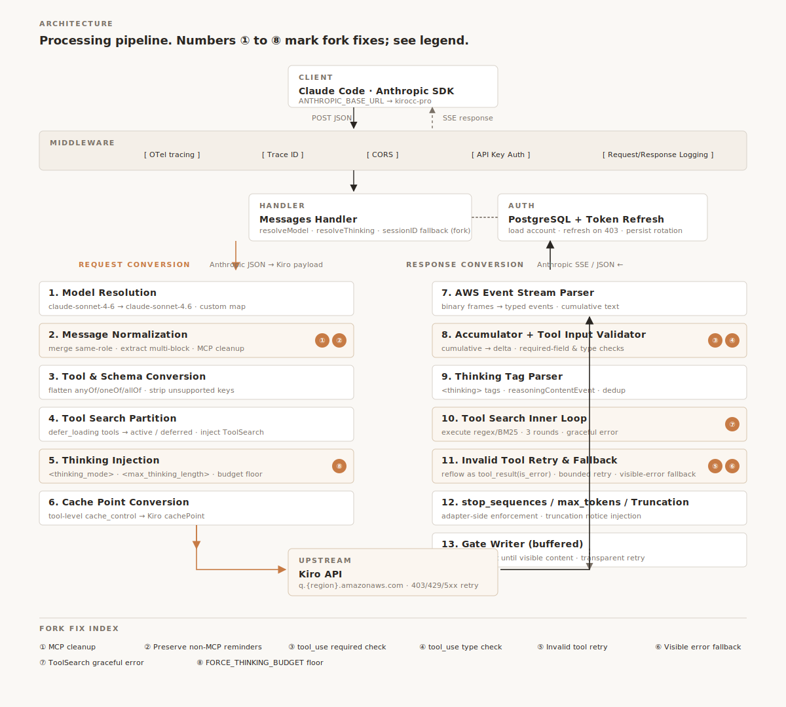
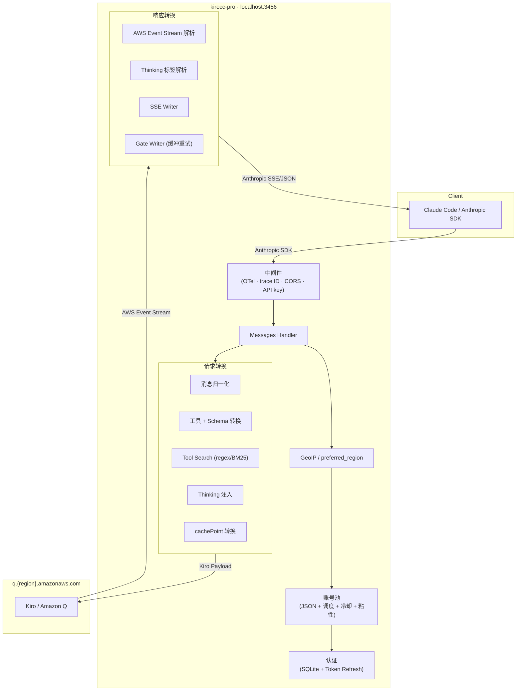
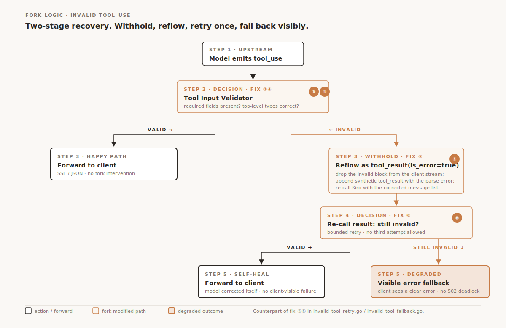

<div align="right">

[English](./README.md) · **简体中文**

</div>

<div align="center">

<p>
  <picture>
    <source media="(prefers-color-scheme: dark)" srcset="./assets/hero-dark.svg">
    <source media="(prefers-color-scheme: light)" srcset="./assets/hero-light.svg">
    
  </picture>
</p>

# kirocc-pro · Anthropic ↔ Kiro 舰队代理

<p>
  
  
  
</p>

<p>
  <a href="./LICENSE"></a>
  
  
  <a href="https://github.com/d-kuro/kirocc"></a>
  <a href="./README_3460_OPTIMIZED.md"></a>
  <a href="./docs/admin-features.zh-CN.md"></a>
</p>

[为什么 kirocc-pro](#为什么-kirocc-pro) · [最新亮点](#最新亮点) · [3 分钟上手](#3-分钟上手) · [核心能力](#核心能力) · [配置参考](#配置参考) · [架构](#架构) · [Fork 说明](#fork-说明)

</div>

---

## 为什么 kirocc-pro

<details open>
<summary><b>① 用 Anthropic SDK 的姿势调 Kiro，附 8 层协议加固</b></summary>

把 Claude Code / 任何 Anthropic SDK 的 `ANTHROPIC_BASE_URL` 指过来，就能用你的 Kiro 凭据调 Claude 模型。**客户端不用动一行代码**。

代理层加了 8 个修复，专治长会话和坏工具调用：

- MCP `system-reminder` 清理，prompt token 测试样本省 **14%**
- `tool_use` 输入做 `required` + 顶层类型校验，坏调用在代理层被拦截
- 非法 `tool_use` 自动回灌为 `tool_result(is_error=true)`，给模型一次自愈机会
- `ToolSearch` 错误隔离、`KIROCC_FORCE_THINKING_BUDGET` 兜底注入...

完整背景：[`README_3460_OPTIMIZED.md`](./README_3460_OPTIMIZED.md)

</details>

<details open>
<summary><b>② 一个进程，托管你整支 Kiro 舰队</b></summary>

不是单账号代理，是**舰队管理工具**。包括：

- **多账号池**：从 JSON 文件批量加载，支持 round-robin / fill-first / least-used 策略
- **会话粘性**：相同会话绑定同一账号 TTL 内不变；命中冷却时只换那一次请求
- **冷却 + 退避**：429 触发指数退避 `30s → 30min`，遵守 `Retry-After`
- **每账号代理**：账号 A 走 socks5://X，账号 B 走 http://Y，避免同 IP 触发风控
- **地区路由**：客户端 IP → GeoIP → 就近 Kiro 区域；或静态 `preferred_region` 兜底
- **多 API 密钥**：给团队不同人发 key，每个独立的**过期时间 + token 额度上限**
- **用量按 key / 设备 / 模型分账**：凌晨被问"昨天烧了多少"3 秒答上

</details>

<details>
<summary><b>③ 全 Web 管理 + 完整远程 API</b></summary>

不必 ssh 上服务器。所有运维操作都有 UI 和 JSON API 对应：

- **赛博风管理后台**：仪表盘、账号卡片、配额环、token 用量曲线（24h/7d/15d/30d 切换）
- **二级菜单系统设置**：运行时 / 认证密钥 / 远程访问 / 系统 / 网络 / 流式 / kirocc 优化 / 远程 API
- **远程 API**：`POST /admin/accounts` 加号、`PATCH /admin/accounts/{id}` 改代理、`POST /admin/api-keys` 发密钥、`/admin/usage?group=api_key|device` 查用量——CI 脚本一行 curl 搞定
- **认证文件可视化**：每条凭据一张卡片，过期 / region / 代理一目了然

详见 [`docs/admin-features.zh-CN.md`](./docs/admin-features.zh-CN.md)。

</details>

---

## 最新亮点

<details>
<summary><b>v2026.05 — 舰队管理大版本</b></summary>

- **侧栏二级菜单**：系统设置展开 8 段子页，路由 `#/settings/<section>` 可直链
- **多 API 密钥 with 过期 + 额度**：UI 创建走预设 chip（7d/30d/60d 过期 · 100k/1M/10M 额度），明文密钥一次性 reveal
- **每账号代理**（`proxy_url` 字段）：OAuth / token refresh / 配额查询都走该代理；同 URL 多账号共享 client 池
- **地区路由**：MaxMind GeoLite2-Country MMDB + `settings.network.preferred_region` 兜底
- **kirocc 优化可视化**：8 个 fix 状态卡 + 7 个 env knob 可编辑持久化（`KIROCC_FORCE_THINKING_BUDGET` 等）
- **用量按 key / device / model 三维度**：仪表盘新增 5 张 LED 统计卡 + 使用统计页 3 个 panel
- **Token 用量曲线**：24h/7d/15d/30d range 切换，双线（input neon green / output cyan）
- **远程 API 子页**：UI 内嵌 curl + Python 速查，URL 自动替换为当前部署地址
- **赛博朋克终端 UI**：磷光绿配色、扫描线、ASCII 角标、LED 呼吸状态指示

</details>

<details>
<summary><b>上游 fork 修复一览（8 项 + session-id 兜底）</b></summary>

| # | 修复 | 效果 |
|---|---|---|
| 1 | 清理历史 MCP `system-reminder` 大段块 | prompt token 测试样本省约 14% |
| 2 | 保留非 MCP 类系统提醒 | `currentDate` 等正常提醒保留 |
| 3 | tool 输入顶层 `required` 字段校验 | `Write {}` 缺字段不穿透客户端 |
| 4 | tool 输入顶层类型校验 | `AskUserQuestion.questions=<string>` 被拦下 |
| 5 | 非法 `tool_use` 自动回灌为 `tool_result(is_error=true)` | 给模型一次本轮自愈机会 |
| 6 | 第二次仍非法降级为可见错误 | 有界重试，避免 502 死锁 |
| 7 | `ToolSearch` 错误返回 `tool_search_tool_result_error` | 单工具坏不杀整轮 |
| 8 | `KIROCC_FORCE_THINKING_BUDGET` 代理层强制下限 | 客户端 thinking 配置不一定传到上游 |

外加 session-id 兜底：`/v1/messages` 缺 `X-Claude-Code-Session-Id` 不再 400，自动用 trace id 合成。

</details>

---

## 3 分钟上手

### 安装

```bash
# 二进制（推荐）
go install github.com/niuma/kirocc-pro/cmd/kirocc@latest

# 源码
git clone https://github.com/niuma/kirocc-pro.git
cd kirocc-pro && GOEXPERIMENT=jsonv2 make build
# 产物在 dist/kirocc
```

前置：Go 1.26+，以及一个已登录的 [Kiro CLI](https://kiro.dev)（提供 SQLite 凭据库）。

### 单账号 30 秒模式

```bash
kirocc                                          # 默认监听 127.0.0.1:3456
export ANTHROPIC_BASE_URL=http://127.0.0.1:3456
export ANTHROPIC_AUTH_TOKEN=dummy               # 没设 -api-key 时仅占位
claude                                          # 起飞
```

### 全功能舰队模式

```bash
./dist/kirocc                                              \
  -creds-json   ~/.config/kirocc/credentials.json          \
  -admin                                                   \
  -admin-port   3457                                       \
  -admin-key    "$(openssl rand -hex 16)"                  \
  -settings     ~/.config/kirocc/settings.json             \
  -usage-db     ~/.config/kirocc/usage.sqlite              \
  -geoip-mmdb   ~/Downloads/GeoLite2-Country.mmdb          # 可选

# 打开 http://127.0.0.1:3457/admin/
```

<details>
<summary><b>第一次添加 Kiro 账号（OAuth 自动 + 手动 token 两种）</b></summary>

**OAuth 自动**：访问 `http://127.0.0.1:3457/admin/#/accounts` → 点「+ 添加 Kiro 账号」→ 可选填代理 URL → 启动 OAuth → 浏览器登录 → 自动写入 credentials.json。

**手动 token**：把 `cockpit-tools` / `cli-proxy-api` 导出的 JSON 数组直接喂给批量导入：

```bash
curl -X POST                                     \
  -H "Authorization: Bearer $KEY"                \
  -H "Content-Type: application/json"            \
  -H "X-Requested-With: XMLHttpRequest"          \
  -d "{\"mode\":\"append\",\"accounts\":$(cat credentials.json)}" \
  http://127.0.0.1:3457/admin/accounts/import
```

</details>

---

## 核心能力

<details>
<summary><b>协议翻译（Anthropic ↔ Kiro）</b></summary>

| 能力 | 说明 |
|---|---|
| `POST /v1/messages` | 流式 SSE 与非流式 JSON 两种模式 |
| `POST /v1/messages/count_tokens` | [tiktoken-go](https://github.com/pkoukk/tiktoken-go) `cl100k_base` 近似 |
| `GET /v1/models` | 列出映射后的 Claude SKU |
| `GET /health` | 健康检查 |

代理双向翻译：

1. **请求侧**：归一化消息、清理 JSON Schema、解析模型名、把 thinking 配置编码成 XML 标签、把 `cache_control` 转换为 Kiro 的 `cachePoint`
2. **认证侧**：从 Kiro CLI SQLite 库读取凭据，过期自动 refresh，原子回写
3. **响应侧**：解析 AWS Event Stream 二进制 frame，累计文本算成增量 delta，拦截 `ToolSearch` 调用，解析 `<thinking>` 标签，代理侧执行 `stop_sequences` 与 `max_tokens` 兜底
4. **Gate Writer**：缓冲输出直到看到可见内容，让 thinking-only 响应可以透明重试

</details>

<details>
<summary><b>智力加固（Extended Thinking · Tool Search · 截断检测）</b></summary>

| 能力 | 做了什么 |
|---|---|
| **Extended Thinking** | XML 注入 `<thinking_mode>` / `<max_thinking_length>`，预算从 `thinking.budget_tokens` → `output_config.effort` → `KIROCC_FORCE_THINKING_BUDGET` 三级回落 |
| **Tool Search** | 在代理层模拟 Anthropic [Tool Search Tool](https://platform.claude.com/docs/en/agents-and-tools/tool-use/tool-search-tool)，支持 `regex_20251119` / `bm25_20251119`，最多 3 轮发现循环 |
| **Prompt Caching** | 工具级 `cache_control` 转换为 Kiro 的 `cachePoint` |
| **截断检测** | 上轮响应被截断时，下轮请求自动注入续写提示 |
| **模型映射** | Anthropic 命名 ↔ Kiro SKU，可通过 `KIROCC_MODEL_MAPPINGS` 自定义 |

**Extended Thinking 触发条件**（任一即可）：

- 模型名带 `[1m]` 后缀（`claude-sonnet-4-6[1m]`）
- `Anthropic-Beta` 头包含 `context-1m`
- `thinking.type` 为 `"enabled"` 或 `"adaptive"`

</details>

<details>
<summary><b>多账号池 · 调度策略</b></summary>

`-creds-json` 指向一个 JSON 数组文件，schema 兼容 cockpit-tools / cli-proxy-api 导出：

```jsonc
[
  {
    "id":       "kiro-alice-001",
    "label":    "alice@example.com (Pro)",
    "priority": 100,
    "proxy_url": "socks5://127.0.0.1:1080",          // 可选 · 每账号独立代理
    "kiro_auth_token_raw": {
      "accessToken":  "<redacted>",
      "refreshToken": "<redacted>",
      "expiresAt":    "2026-05-20T10:00:00Z",
      "profileArn":   "arn:aws:codewhisperer:us-east-1:000000000000:profile/EXAMPLE",
      "authMethod":   "Social",
      "region":       "us-east-1"
    }
  }
]
```

**调度策略对比**

| `-pool-strategy` | 行为 | 适用 |
|---|---|---|
| `round-robin`（默认）| 同优先级轮询 | 同 tier 账号均衡负载 |
| `fill-first` | 一直用最高优先级账号直到它冷却 | tier-1 先耗尽再换 tier-2 |
| `least-used` | 最高 tier 内挑成功次数最少 | 长期希望均匀消耗 |

**冷却**：429 触发指数退避 `30s → 60s → 120s → ... → 30min 上限`，存在 `Retry-After` 时优先采用。`"disable_cooling": true` 跳过冷却（适合无限额度账号）。

**会话粘性**：每个 Claude Code 会话由 `X-Claude-Code-Session-Id` 标识，在 TTL（`-affinity-ttl` 默认 30min）内绑定同一账号。绑定账号冷却时**只对该请求临时换号**，恢复后自动切回。

**自动 Token 刷新**：单账号走 SQLite + AuthManager；多账号每个凭据在过期前 5 分钟预先刷新，原子写回 JSON 文件。刷新失败时只 WARN，仍用原 token；上游若 403，凭据标记 auth-error，下次切换。

</details>

<details>
<summary><b>地区路由（B1 静态偏好 + B2 GeoIP 自动）</b></summary>

```
   ┌──────────┐
   │ request  │
   └────┬─────┘
        ▼
   GeoIP 加载了？──── no ────┐
        │                    │
       yes                   ▼
        ▼            preferred_region 设了？─── no ──┐
   client IP                  │                       │
   ↓                         yes                      ▼
   IP→国家码→AWS region        ▼                  无 hint
        │                  用这个                  ↓
        ▼                      │              原 strategy
   region "us-east-1"          │             (round-robin)
        │                      │
        └────────┬─────────────┘
                 ▼
        Conductor 过滤：精确匹配 → 大洲前缀 → 全集兜底
                 ▼
        Selector.Pick(filtered)
```

**怎么开 GeoIP**

```bash
# 1. https://www.maxmind.com/en/geolite2/signup 注册账号拿 license key
# 2. 下载 GeoLite2-Country.mmdb（~6MB，月更）
# 3. 启动加：
kirocc -geoip-mmdb ~/.config/kirocc/GeoLite2-Country.mmdb

# UI 系统设置 → 运行时 会显示 ✓ GeoLite2-Country · 构建于 32 天前
```

**国家 → 区域**（11 类映射，[完整表](./docs/admin-features.zh-CN.md#b2--geoip-自动路由)）

| 区域 | 覆盖 |
|---|---|
| `us-east-1` | US · CA · MX |
| `sa-east-1` | BR AR CL CO PE ... |
| `eu-west-1` | GB IE FR DE NL ... |
| `eu-central-1` | PL RU UA TR ... |
| `ap-northeast-1` | JP · KR |
| `ap-east-1` | CN HK TW MO |
| `ap-southeast-1` | SG MY ID TH ... |
| ... | ... |

私网 / loopback IP 直接跳过查询。GeoLite2-Country 只到国家级，要分东西海岸需升级到 GeoLite2-City。

</details>

<details>
<summary><b>管理后台 · 远程 API</b></summary>

独立的 HTTP 监听器在 `127.0.0.1:3457`（可配置），与代理端口**完全隔离**。代理 URL 上无法访问任何 admin 路径。

**认证**：

- 未设 `-admin-key` = 开放模式（仅 loopback，启动 WARN 警告）
- 设了 `-admin-key` = Cookie session（浏览器）+ Bearer token（CLI）双模式
- mutating 操作（POST/PUT/PATCH/DELETE）要带 `X-Requested-With: XMLHttpRequest`（绕 CSRF）

**核心端点速查**

```
ACCOUNTS    GET/POST/PATCH/DELETE /admin/accounts[/{id}]
            POST                  /admin/accounts/import
            POST                  /admin/accounts/{id}/refresh|disable|enable

API KEYS    GET/POST              /admin/api-keys
            PATCH/DELETE          /admin/api-keys/{id}
            POST                  /admin/api-keys/{id}/rotate

USAGE       GET                   /admin/usage?group=model|api_key|device
            GET                   /admin/usage/timeline?window=&bucket=
            GET                   /admin/usage/recent

OAUTH       POST/GET              /admin/oauth/start|status|manual_callback

SETTINGS    GET/PUT               /admin/settings
            GET                   /admin/optimizations
```

完整 curl + Python 速查见 [`docs/admin-features.zh-CN.md`](./docs/admin-features.zh-CN.md#故事-05) 或直接访问 admin UI `#/settings/api`。

</details>

<details>
<summary><b>用量统计（key · device · model 三维度）</b></summary>

每个 `/v1/messages` 请求落 `usage.sqlite`，带：

- `api_key_id`：匹配的 dynamic key id，`""` = legacy `-api-key`
- `device_id`：`sha256(client_ip + user_agent)[:12]` 设备指纹
- `resolved_model`：上游实际路由的模型
- `credential_id`：池调度命中的账号
- 时间戳 / token 数 / 状态 / 延迟 / trace id

**双层存储**：内存 ring（`-usage-mem-cap`，默认 10000）+ SQLite append log（`-usage-db`）。前者给 dashboard 近期快速查询，后者超出 ring 的历史窗口查询。`(api_key_id, ts)` / `(device_id, ts)` 联合索引已建。

</details>

<details>
<summary><b>kirocc 优化（fix #8 + 6 个 env knob 可视化）</b></summary>

系统设置 → kirocc 优化 子页：

- **协议修复（Always-On）**：8 个 fix 的状态卡片，前 7 个硬编码 always-on，fix #8 显示当前 env 值
- **可调参数**：7 个 knob 表单 + 保存按钮

字段（`settings.optimizations`）

| 字段 | 环境变量 | 含义 |
|---|---|---|
| `force_thinking_budget` | `KIROCC_FORCE_THINKING_BUDGET` | thinking budget 下限，`0` = 不强制 |
| `thinking_prompt_mode` | `KIROCC_EXPERIMENT_THINKING_PROMPT` | `""` / `"tool"` / `"minimal"` |
| `thinking_tool_continue_mode` | `KIROCC_EXPERIMENT_THINKING_TOOL_CONTINUE` | `""` / `"assistant_only"` |
| `system_mode` | `KIROCC_EXPERIMENT_SYSTEM_MODE` | 实验性 |
| `upstream_origin` | `KIROCC_UPSTREAM_ORIGIN` | 覆盖 Origin |
| `model_mappings` | `KIROCC_MODEL_MAPPINGS` | JSON 模型映射 |
| `audit_log` | `KIROCC_AUDIT_LOG` | 审计日志路径（debug 用）|

UI 保存到 `settings.json`，启动时**若对应 env 未显式设置**，从 settings 加载到 env。**显式 env 始终优先**——systemd unit 里写死的 env 不会被 UI 误改。

</details>

---

## 配置参考

<details>
<summary><b>命令行参数全表</b></summary>

| 参数 | 默认 | 说明 |
|---|---|---|
| `-port` | `3456` | 代理监听端口 |
| `-host` | `127.0.0.1` | 代理绑定地址 |
| `-db` | OS 默认 | Kiro CLI SQLite 路径 |
| `-api-key` | 空 | 代理本身的 API key |
| `-debug` | `false` | debug 日志 |
| `-log-file` 等 | 见 fork | 文件日志参数族 |
| `-otel` / `-otel-body-limit` | 关 / 32k | OpenTelemetry tracing |
| `-creds-json` | `~/.config/kirocc/credentials.json` 自动 | 多账号 JSON 池路径 |
| `-pool-strategy` | `round-robin` | `round-robin` \| `fill-first` \| `least-used` |
| `-affinity-ttl` | `30m` | 会话粘性 TTL |
| `-admin` | `true` | 启用 admin HTTP |
| `-admin-host` | `127.0.0.1` | admin 绑定地址 |
| `-admin-port` | `3457` | admin 监听端口 |
| `-admin-key` | 空 | admin 登录密钥；空 = 开放（启动 WARN） |
| `-admin-tls-cert` / `-admin-tls-key` | 空 | PEM 文件，启用 HTTPS |
| `-admin-public-url` | 空 | 反代后外部地址（OAuth redirect_uri 用）|
| `-usage-db` | `~/.config/kirocc/usage.sqlite` | 用量持久化路径 |
| `-usage-mem-cap` | `10000` | 内存 ring 容量 |
| `-quota-poll-interval` | `1m` | Kiro 配额自动刷新间隔 |
| `-settings` | `~/.config/kirocc/settings.json` | 运行时配置持久化路径 |
| `-geoip-mmdb` | 空 | GeoLite2-Country MMDB 文件路径 |
| `-codex-proxy` | 空 | Codex provider 出站代理 |

</details>

<details>
<summary><b>环境变量（与 flag 一一对应）</b></summary>

| 变量 | 等价 flag |
|---|---|
| `KIROCC_PORT` · `KIROCC_HOST` · `KIROCC_DB_PATH` · `KIROCC_API_KEY` · `KIROCC_DEBUG` · `KIROCC_OTEL` · `KIROCC_OTEL_BODY_LIMIT` | 同名 flag |
| `KIROCC_LOG_FILE` · `KIROCC_LOG_MAX_SIZE` · `KIROCC_LOG_MAX_BACKUPS` · `KIROCC_LOG_MAX_AGE` · `KIROCC_LOG_COMPRESS` · `KIROCC_LOG_CONSOLE` | 同名 flag |
| `KIROCC_CREDS_JSON` · `KIROCC_POOL_STRATEGY` · `KIROCC_AFFINITY_TTL` | 池配置 |
| `KIROCC_ADMIN` · `KIROCC_ADMIN_HOST` · `KIROCC_ADMIN_PORT` · `KIROCC_ADMIN_KEY` · `KIROCC_ADMIN_PUBLIC_URL` · `KIROCC_ADMIN_TLS_CERT` · `KIROCC_ADMIN_TLS_KEY` | admin 配置 |
| `KIROCC_USAGE_DB` · `KIROCC_USAGE_MEM_CAP` · `KIROCC_QUOTA_POLL_INTERVAL` | 用量配置 |
| `KIROCC_SETTINGS` · `KIROCC_GEOIP_MMDB` | 持久化 & GeoIP |
| `KIROCC_MODEL_MAPPINGS` · `KIROCC_FORCE_THINKING_BUDGET` · `KIROCC_EXPERIMENT_*` · `KIROCC_AUDIT_LOG` · `KIROCC_UPSTREAM_ORIGIN` | 优化 knob |

</details>

<details>
<summary><b>模型映射</b></summary>

| 请求模型 | Kiro SKU | 上下文 |
|---|---|---|
| `claude-sonnet-4-6` | `claude-sonnet-4.6` | 200k |
| `claude-sonnet-4-6[1m]` | `claude-sonnet-4.6-1m` | 1M |
| `claude-sonnet-4.5` | `claude-sonnet-4.5` | 200k |
| `claude-sonnet-4.5[1m]` | `claude-sonnet-4.5-1m` | 1M |
| `claude-opus-4-7` / `[1m]` | `claude-opus-4.7` | 1M |
| `claude-opus-4-6` / `[1m]` | `claude-opus-4.6` | 1M |
| `claude-opus-4.5` | `claude-opus-4.5` | 200k |
| `claude-haiku-4.5` | `claude-haiku-4.5` | 200k |

**`[1m]` 后缀语义**：请求侧是 thinking 触发信号（路由前剥掉）；响应侧是上下文窗口标识。Claude Code 客户端靠响应 `model` 字段里的 `[1m]` 判断 1M 窗口，缺这个后缀即使上游真有 1M 也会在约 160k 时触发 auto-compact。

自定义：

```bash
export KIROCC_MODEL_MAPPINGS='[{"anthropic":"my-model","kiro":"claude-sonnet-4.5","context_window_size":200000}]'
```

</details>

<details>
<summary><b>Kiro CLI SQLite 默认路径</b></summary>

| OS | 路径 |
|---|---|
| macOS | `~/Library/Application Support/kiro-cli/data.sqlite3` |
| Linux | `~/.local/share/kiro-cli/data.sqlite3` |

</details>

---

## 架构

<details>
<summary><b>整体数据流图</b></summary>

<p align="center">
  <picture>
    <source media="(prefers-color-scheme: dark)" srcset="./assets/architecture-dark.svg">
    <source media="(prefers-color-scheme: light)" srcset="./assets/architecture-light.svg">
    
  </picture>
</p>



</details>

<details>
<summary><b>非法 tool_use 两段恢复决策树（fix 5/6）</b></summary>

<p align="center">
  <picture>
    <source media="(prefers-color-scheme: dark)" srcset="./assets/logic-invalid-tool-dark.svg">
    <source media="(prefers-color-scheme: light)" srcset="./assets/logic-invalid-tool-light.svg">
    
  </picture>
</p>

</details>

---

## 安全与隐私

> **三条红线**

```
① admin-key 即 web 登录密码 + Bearer token，写进自动化脚本前确认环境安全
② 暴露到非 loopback 必须 TLS（-admin-tls-cert/-key）+ 强 admin-key
③ KIROCC_AUDIT_LOG 写完整 prompt/response，仅 debug 用，生产关掉
```

附加：

- 不要把 Kiro SQLite、`credentials.json` 提交到仓库——代理只读，不外传
- 代理永远不会记录 access/refresh token；`ProfileARN` 与请求 URL 仅 debug 级别出现
- 创建 / 轮换 API key 返回的明文是**唯一一次展示**，丢了只能 rotate
- 设备指纹 `sha256(ip+ua)[:12]` 48 位熵，能区分设备但不能反推 IP
- `/admin/accounts` 列表对邮箱形 label 做掩码（`alice@example.com` → `a***@example.com`）

---

## Fork 说明

这是 [`d-kuro/kirocc`](https://github.com/d-kuro/kirocc) 的下游 fork，遵循 **Apache-2.0**。

- 上游版权头与原 `LICENSE` 文件保持不变
- fork 修改文件以 `// [fork]` 标注，符合 Apache-2.0 § 4(b) "modified files prominent notice" 要求
- 新增的 admin UI / 池管理 / GeoIP / 优化 knob 等代码版权归本项目
- 详细 attribution 见 [`NOTICE`](./NOTICE)

**上游问题**请到 [d-kuro/kirocc](https://github.com/d-kuro/kirocc/issues) 报；**fork 专属问题**（admin UI、池、代理等）来本仓库 issues 报。

---

## License

[Apache License 2.0](./LICENSE) · 详细 attribution 见 [`NOTICE`](./NOTICE) · 完整 admin 能力文档见 [`docs/admin-features.zh-CN.md`](./docs/admin-features.zh-CN.md)

<div align="center">

```
   ╔════════════════════════════════════════════════╗
   ║   kirocc 解决"协议加固"                          ║
   ║   kirocc-pro 解决"舰队运维"                      ║
   ╚════════════════════════════════════════════════╝
```

</div>
