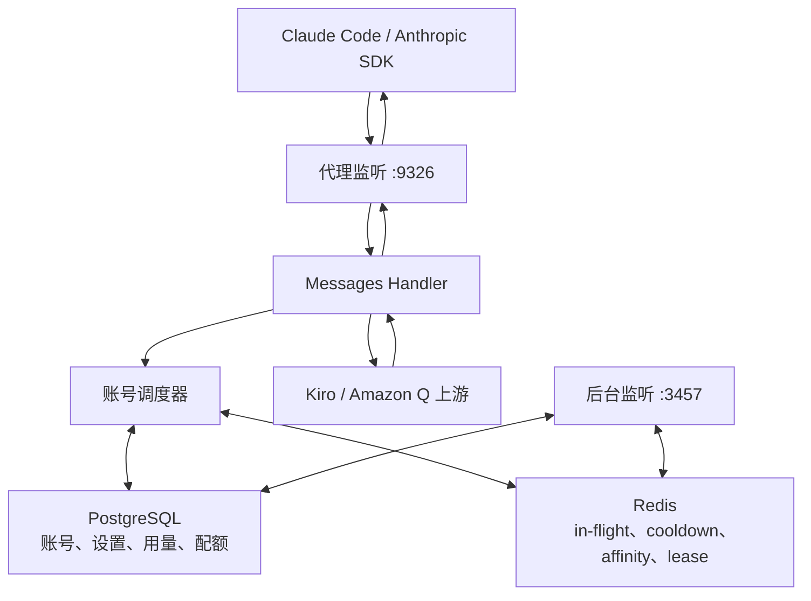

<div align="right">

[English](./README.md) · **简体中文**

</div>

<p align="center">
  <picture>
    <source media="(prefers-color-scheme: dark)" srcset="./assets/hero-dark.svg">
    <source media="(prefers-color-scheme: light)" srcset="./assets/hero-light.svg">
    
  </picture>
</p>

# kirocc-pro

kirocc-pro 是一个本地代理：前端接受 Anthropic Messages API，后端调用 Kiro / Amazon Q CodeWhisperer 上游。Claude Code 或 Anthropic 兼容 SDK 只需要把 `ANTHROPIC_BASE_URL` 指向本服务。

当前架构已经按 PostgreSQL + Redis 一次性到位：

| 范围 | 后端 |
|---|---|
| 账号、OAuth 凭据、配额快照 | PostgreSQL |
| 系统设置、动态 API key | PostgreSQL |
| 请求记录、用量历史 | PostgreSQL |
| in-flight、cooldown、会话粘性、reservation lease | Redis |

系统不再存在本地文件持久化模式，也不再存在单账号 fallback。JSON 只作为后台导入请求体存在，导入后会被归一化并写入 PostgreSQL。

完整迁移审计见 [`docs/pgredis-complete-migration-audit.zh-CN.md`](./docs/pgredis-complete-migration-audit.zh-CN.md)。

## 快速启动

前置条件：

- Go 1.26+
- `GOEXPERIMENT=jsonv2`
- Docker Compose，用于本地启动 PostgreSQL 和 Redis
- 至少一个通过后台 UI 或后台 API 添加的 Kiro 账号

启动本地基础设施：

```bash
docker compose -f docker-compose.dev.yml up -d
```

启动服务：

```bash
GOEXPERIMENT=jsonv2 go run ./cmd/kirocc \
  -pool-strategy least-inflight
```

默认端口：

| 服务 | 地址 |
|---|---|
| 代理 | `http://127.0.0.1:9326` |
| 管理后台 | `http://127.0.0.1:3457/admin/` |
| PostgreSQL | `127.0.0.1:15432` |
| Redis | `127.0.0.1:16379` |

Claude Code 使用方式：

```bash
export ANTHROPIC_BASE_URL=http://127.0.0.1:9326
export ANTHROPIC_AUTH_TOKEN=dummy
claude
```

如果启动时配置了 `-api-key`，这里的 `ANTHROPIC_AUTH_TOKEN` 要填写对应 key。

## 添加账号

进入后台 `#/accounts`：

- OAuth 自动添加：点添加账号，可选填 `proxy_url`，浏览器登录后写入 PostgreSQL。
- 文件导入：上传或粘贴账号 JSON / JSONL。服务端支持常见 camelCase、snake_case 写法，先归一化，再做最终校验，最后写入 PostgreSQL。

导入文件只是数据入口，不是系统存储后端。账号编辑、token refresh、quota 快照和删除都以 PostgreSQL 为权威。

## 路由

标准 Anthropic 兼容路径保持不变：

```text
/v1/models
/v1/messages
/v1/messages/count_tokens
```

自定义后端路径统一挂在 `/api` 前缀下，避免覆盖前端路由：

```text
/api/cc/v1/models
/api/cc/v1/messages
/api/cc/v1/messages/count_tokens

/api/ha/v1/models
/api/ha/v1/messages
/api/ha/v1/messages/count_tokens

/api/na/v1/models
/api/na/v1/messages
/api/na/v1/messages/count_tokens
```

如果配置自定义路由名为 `<name>`，实际生效前缀是 `/api/<name>`。`/v1` 是标准路径，不加 `/api`。

## 核心能力

| 能力 | 说明 |
|---|---|
| Anthropic Messages API | 支持流式 SSE 和非流式 JSON |
| 模型映射 | Anthropic 形式模型名映射到 Kiro SKU |
| Extended Thinking | 根据模型后缀、beta header 或 request thinking 配置注入上游 XML |
| Tool Search | 本地模拟 Anthropic Tool Search，支持 regex / BM25 |
| Prompt Cache 上报 | 按路径和 profile 修改下游 usage 上报，不改上游 payload |
| 截断检测 | 上轮输出被截断后，下轮请求自动注入续写提示 |
| 多账号调度 | `round-robin`、`fill-first`、`least-used`、`least-inflight`、`weighted-least-inflight` |
| 单账号并发上限 | `max_in_flight` 控制每个账号同时运行的上游请求 |
| 会话粘性 | Redis TTL 绑定 session 到账号 |
| 冷却 | Redis 记录账号级和模型级 cooldown，支持 `Retry-After` |
| 配额轮询 | 周期性刷新 Kiro quota，刷新任务限并发排队 |
| 请求记录 | 记录路径、账号、API key、状态、错误、首字 token 延迟和 token usage |

## 调度说明

调度器会在进程内保留账号快照，用于快速选择账号；跨请求运行态由 Redis 协调：

- `in-flight`：账号或账号+模型当前正在运行的请求数。
- `per-account 并发上限`：Redis reservation 达到 `max_in_flight` 后，该账号不再接新请求。
- `least-inflight`：优先选择当前运行请求最少的账号。
- `cooldown`：429、认证失败等状态写入 Redis TTL。
- `reservation lease`：每次获取账号都会创建 Redis lease，进程异常时也能在 TTL 后释放容量。

几十到 100 个账号、约 300 RPM 的场景，默认建议使用 `least-inflight` 或 `weighted-least-inflight`。如果明确要优先消耗高优先级账号，才使用 `fill-first`。

## Prompt Cache 上报

缓存上报模块只影响下游 Anthropic 兼容 response usage，不修改发往 Kiro 的请求。

默认 profile：

| 路径 | Profile | 行为 |
|---|---|---|
| `/v1/messages` | `default` | 保留 input/output，使用本地计算的 cache read/write |
| `/api/cc` | `cc` | 按配置上限采样可见 input，差值转入 cache read |
| `/api/ha` | `ha` | 类似 input 采样，保留本地 cache creation |
| `/api/na` | `na` | 不做本地模拟补足 |

系统设置里有“缓存上报”二级 tab，支持表单配置和 JSON 配置。字段级解释见 [`docs/prompt-cache-report-profiles.zh-CN.md`](./docs/prompt-cache-report-profiles.zh-CN.md)。

## 管理后台

后台服务是独立监听器，默认 `127.0.0.1:3457`，不和代理端口混用。

| 方法 | 路径 | 说明 |
|---|---|---|
| `GET` | `/admin/health` | 池状态和 quota 汇总 |
| `GET` | `/admin/accounts` | 账号列表、quota、in-flight |
| `POST` | `/admin/accounts` | 添加单个账号 |
| `POST` | `/admin/accounts/import` | 从请求体导入账号 |
| `POST` | `/admin/accounts/{id}/refresh` | 排队刷新账号 quota |
| `PATCH` | `/admin/accounts/{id}` | 修改账号元数据 |
| `DELETE` | `/admin/accounts/{id}` | 从 PostgreSQL 和调度器删除 |
| `GET` | `/admin/usage/recent` | 请求记录 |
| `GET` | `/admin/usage` | 按模型、API key、设备或账号聚合 |
| `GET` / `PUT` | `/admin/settings` | PostgreSQL 持久化的运行时设置 |

`/admin/credsfile` 只保留为旧客户端 tombstone，固定返回 `410 Gone`。

## 配置

主要启动参数：

| 参数 | 默认 | 说明 |
|---|---|---|
| `-port` | `9326` | 代理监听端口 |
| `-host` | `127.0.0.1` | 代理绑定地址 |
| `-api-key` | 空 | 代理 API key |
| `-admin` | `true` | 启用后台 |
| `-admin-host` | `127.0.0.1` | 后台绑定地址 |
| `-admin-port` | `3457` | 后台端口 |
| `-admin-key` | 空 | 后台登录 key |
| `-pool-strategy` | `round-robin` | 账号选择策略 |
| `-affinity-ttl` | `30m` | Redis 会话粘性 TTL |
| `-usage-mem-cap` | `10000` | 内存近期 usage ring 容量 |
| `-quota-poll-interval` | `3m` | 自动 quota 刷新间隔 |
| `-postgres-dsn` | 本地开发 DSN | PostgreSQL 权威存储 |
| `-redis-addr` | `127.0.0.1:16379` | Redis 地址 |
| `-redis-password` | 空 | Redis 密码 |
| `-redis-db` | `0` | Redis database number |
| `-redis-key-prefix` | `kirocc:dev:` | Redis key 前缀 |
| `-redis-lease-ttl` | `30m` | in-flight reservation lease |
| `-prompt-cache-reports` | 空 | 缓存上报 profile JSON 覆盖 |
| `-geoip-mmdb` | 空 | GeoLite2-Country 文件 |
| `-codex-proxy` | 空 | Codex provider 出站代理 |

环境变量与这些参数对应，例如 `KIROCC_POSTGRES_DSN`、`KIROCC_REDIS_ADDR`、`KIROCC_POOL_STRATEGY`、`KIROCC_ADMIN_KEY`、`KIROCC_PROMPT_CACHE_REPORTS`、`KIROCC_GEOIP_MMDB`。

旧本地文件模式的环境变量会在启动阶段被拒绝。准确拒绝清单见迁移审计文档。

## 开发验证

```bash
node --check internal/admin/html/app.js
GOEXPERIMENT=jsonv2 go test ./...
GOEXPERIMENT=jsonv2 go test -run '^$' -tags e2e ./internal/e2e
```

发布前还需要按迁移审计文档执行依赖残留检查。

## 架构



## 安全

- 代理和后台默认只绑定 loopback；暴露到公网前必须配置反向代理、TLS 和防火墙。
- 非本机客户端必须配置 `-api-key`。
- 后台暴露到可信机器之外前必须配置 `-admin-key`。
- token 存在 PostgreSQL，不会通过普通列表 API 打印。
- 账号详情是运维接口，只应给可信管理员访问。

## License

[Apache License 2.0](./LICENSE)。本项目是 [`d-kuro/kirocc`](https://github.com/d-kuro/kirocc) 的下游，保留上游版权声明。
